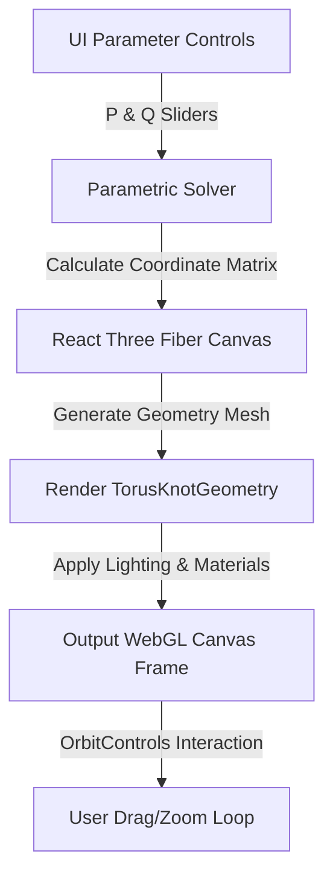

# 🌀 Knot-Theory-3D: WebGL Torus Knot & Topology Simulator

Knot-Theory-3D is a GPU-accelerated interactive 3D WebGL application for visualizing mathematical manifolds, parametric torus knots, and algebraic topology structures in the browser. Built using React Three Fiber, Three.js, and Tailwind CSS, it offers a real-time playground for exploring topological invariant configurations.

---

## 📐 Mathematical Framework

A torus knot $T(p,q)$ is a closed curve that wraps around a torus (doughnut shape) $p$ times around the major axis and $q$ times through the hole.

### 1. Parametric Equations
The 3D spatial coordinates $(x, y, z)$ of the knot are computed as functions of the angle $\theta \in [0, 2\pi]$:

$$x(\theta) = (R + r\cos(q\theta))\cos(p\theta)$$
$$y(\theta) = (R + r\cos(q\theta))\sin(p\theta)$$
$$z(\theta) = r\sin(q\theta)$$

where:
- $R$ is the major radius (distance from center of tube to center of torus).
- $r$ is the minor radius (radius of the tube).
- $p$ and $q$ are co-prime integers indicating the wrapping parameters.

### 2. Invariant Properties
- **Knot Genus ($g$)**: The minimal genus of a Seifert surface bounded by the knot, calculated as:
  $$g = \frac{(p - 1)(q - 1)}{2}$$
- **Alexander Polynomial ($\Delta(t)$)**: An algebraic knot invariant computed for $T(p,q)$ as:
  $$\Delta(t) = \frac{(t^{pq} - 1)(t - 1)}{(t^p - 1)(t^q - 1)}$$

---

## 🛠️ Workings & Pipeline



1. **Parametric Evaluation**: Re-computes mesh points on-the-fly when sliders for wrap factors $p$ and $q$ are adjusted.
2. **GPU-Accelerated Rendering**: Utilizes standard shader programs to render metalness, roughness, and wireframe options.
3. **Interactive Navigation**: Integrates orbit controls, letting users rotate, pan, and zoom around the topological manifold.

---

## 💎 Key Advantages

- **Modern Aesthetics**: Leverages glassmorphic overlay dashboards, responsive layouts, and vibrant dark-mode palettes.
- **GPU Efficient**: Handled directly in WebGL context via Three.js, keeping memory footprint low.
- **Calculated Invariants**: Displays algebraic properties (such as genus and Conway polynomials) alongside the physical geometry.

---

## 📦 How to Install and Run

### Prerequisites
- Node.js 18.0 or higher
- npm or yarn

### Setup
Navigate to the directory and install dependencies:
```bash
npm install
```

### Running Locally
To launch the Vite development server:
```bash
npm run dev
```
Open [http://localhost:5173](http://localhost:5173) in your browser.

---

<div align="center">
  <a href="https://q.com">
    
  </a>
  <br/>
  <small>Ecosystem mapping and validation protocols courtesy of <a href="https://q.com">q.com</a></small>
</div>

## Performance Benchmark

*Benchmark not available:* No benchmark script found
